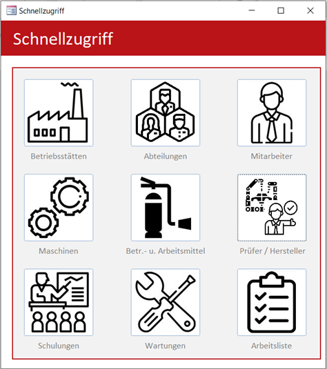
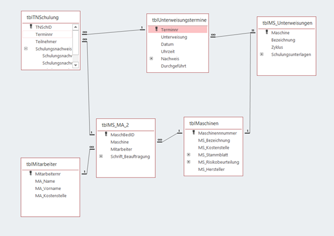
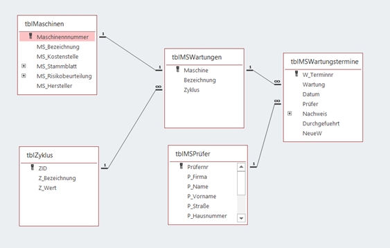
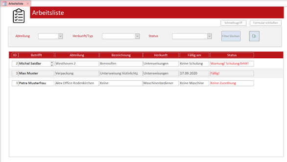

# Datenbank Arbeitssicherheitsmanagement  
  

> Formular *Schnellzugriff* 

## Inhaltsverzeichnis  
[**1. Projektübersicht und -ziel**](#1-projektübersicht-und--ziel)  
[**2. Aufbau der Datenbank**](#2-aufbau-der-datenbank)  
1. [Tabellen](#21-tabellen)  
2. [Beziehungen](#22-beziehungen)  
3. [Abfragen](#23-abfragen)   
4. [Formulare](#24-formulare)  

[**3. Dokumentation**](#3-dokumentation)    
1. [Benutzerhandbuch](#3-dokumentation)  
2. [Ablaufbeschreibung](#3-dokumentation)  
3. [Programmpunkt & Layout](#3-dokumentation)

---

## 1. Projektübersicht und -Ziel  
Ziel ist die Strukturierung sowie Standardisierung des Prozesses der Dokumentation, Überprüfung und Überwachung der nötigen Arbeitssicherheitsschulungen von Mitarbeiter:Innen und anstehender Wartungen von Maschinen. Die Einführung soll den Prozess automatisieren und wertvolle Personalressourcen einsparen. Aufgrund limitierter Ressourcen wurde auf das im Unternehmen bereits vorhandene DBMS Microsoft-Access zurückgegriffen.

> Aus Datenschutzgründen können keine Angaben zu Unternehmen und Projektbeteiligten gemacht werden. Für die bessere Lesbarkeit werden Inhalte gekürzt dargestellt. Die Dokumentation und das Handbuch sind dementsprechend stark auf das Wesentliche reduziert. 

---

## 2. Aufbau der Datenbank  
Innerhalb der Datenbank werden Betriebsstätten, Abteilungen und Mitarbeiter, sowie Maschinen, Prüfer, Hersteller als auch Schulungen und Unterweisungen hinterlegt. Per Beziehungen und Hilfstabellen lassen sich Schulungs- und Unterweisungstermine und -unterlagen den Mitarbeitern und Maschinen zuordnen. Die Mitarbeiter werden Abteilungen und Betriebsstätten zugeordnet, bei Maschinen werden Prüfer und Hersteller hinterlegt. Die einzelnen Formulare lassen sich über das Formular Schnellzugriff öffnen, der sich mit Start der Datenbank öffnet.

Als zentrale Übersicht und Hauptfunktion der Datenbank dient die Arbeitsliste. Diese stellt alle fälligen Schulungen und Wartungen übersichtlich dar. Zusätzlich wird angezeigt, wenn Unterlagen fehlen. 

> Weitere Informationen zum Aufbau befinden sich in der [Ablaufbeschreibung](docs/Ablaufbeschreibung.pdf)

Die Arbeitsliste fragt per UNION Abfrage die Daten aus verschiedenen Tabellen ab und stellt sie in einheitlicher Form dar. Siehe dazu [2.3 Abfragen](#23-abfragen)


### 2.1 Tabellen  
>Hinweis: Hierbei handelt es sich nur um einen Auszug der relevanten Tabellen.

**Stammdaten**
```
tblBetriebsstätte
tblAbteilung
tblMitarbeiter
tblMaschinen
...
```

**Unterweisungen**
```
tblMS_Unterweisungen
tblTNSchulung
tblUnterweisungstermine
...
```

**Hilfstabellen**
```
tblKategorien
tblMSPrüfer
tblZyklus
...
```

### 2.2 Beziehungen  
>Auszug aus den Beziehungen der Tabellen der Datenbank  

**1. Beziehung Mitarbeiter, Maschine (Hilfstabelle Maschinenbediener) und Unterweisungstermine**  

  
>*Der Ausschnitt stellt die Beziehung zwischen den Tabellen tblMitarbeiter, tblMaschinen und tblUnterweisungstermine dar.  
Es ist eine mehrwertige Beziehung (n:m) zwischen diesen Tabellen notwendig.  
Eine mehrwertige Beziehung bedarf einer Hilfstabelle, die die Primärschlüssel beider Tabellen als Fremdschlüssel aufnimmt.*

--- 

**2. Beziehung Maschine und Wartung**  

  
>*Zwischen tblMaschinen und tblMSWartungen besteht eine 1:1 Beziehung.   
In tblMSWartungen wird u. a. der Wartungszyklus hinterlegt. 
Jede Wartung kann mehrere Wartungstermine haben, daher besteht eine 1:n Beziehung zwischen tblMSWartungen und tblMSWartungstermine.*  

---

### 2.3 Abfragen  
**Union-Abfrage für die Arbeitsliste**

```
SELECT
    tblMitarbeiter_Unterweisung.MA_Vorname & " " & tblMitarbeiter_Unterweisung.MA_Name AS Typ,
    tblMitarbeiter_Unterweisung.MA_Kostenstelle AS Kst,
    tblMitarbeiter_Unterweisung.Bezeichnung,
    tblMitarbeiter_Unterweisung.Datum,
    tblMitarbeiter_Unterweisung.Zyklus,
    tblMitarbeiter_Unterweisung.Fällig,
    tblMitarbeiter_Unterweisung.Status
FROM
    tblMitarbeiter_Unterweisung,
    tblMitarbeiter
UNION
SELECT
    [tblMSWartungstermine Abfrage].MS_Bezeichnung,
    [tblMSWartungstermine Abfrage].MS_Kostenstelle,
    [tblMSWartungstermine Abfrage].Bezeichnung,
    [tblMSWartungstermine Abfrage].Datum,
    [tblMSWartungstermine Abfrage].Zyklus,
    [tblMSWartungstermine Abfrage].Fällig,
    [tblMSWartungstermine Abfrage].Status
FROM
    [tblMSWartungstermine Abfrage]
ORDER BY
    [Fällig];

```

Berechnung der Fälligkeit von Schulungen und Wartungen (Zyklus)  
<pre>
SELECT […], DateAdd("m",[Zyklus],[Datum]) AS Fällig
FROM […]
</pre>


---

### 2.4 Formulare  

  

> ***Der Schnellzugriff bietet eine Übersicht über alle zugänglichen Programmpunkte.*** 


---



> ***Die Arbeitsliste ist das Herzstück der Datenbank und dient dazu, alle fälligen Schulungen und Wartungen übersichtlich darzustellen.***

---


> ***Mitarbeiterformulare mit Maschinenzuordnung und Übersicht über Unterweisungen***

---


> ***Hersteller mit Kontaktdaten und Bemerkungsfeld***


Weitere befinden sich im Ordner [`images/`](images/).

---

## 3. Dokumentation

> Hinweis: Aus Datenschutzgründen wurde die Dokumentation an entsprechenden Stellen gekürzt.

- [Benutzerhandbuch](docs/Benutzerhandbuch.pdf)
- [Ablaufbeschreibung](docs/Ablaufbeschreibung.pdf)
- [Programmpunkte & Layout](docs/Programmpunkte%20und%20Layout.pdf)

